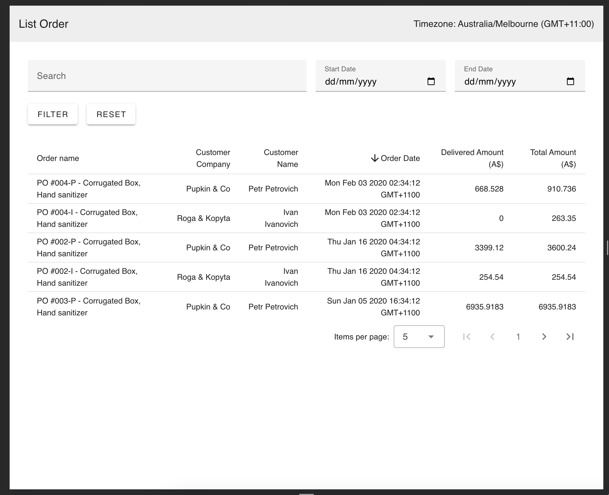

# pforder-frontend

## Information
### How To Run
1. Run `npm install` to install node_modules
2. Make sure `BASE_URL` and other configs are correct in `src/config.ts` 
2. Run `npm dev` to start the dev frontend server

### Feature Test
#### 1. User can search and filter with date range
Before

After

#### 2. User can change page and only show 5 per page
Page 1

Page 2 

#### 3. User can order the order_date desc or asc
Order Asc (default)

Order Desc

#### 4. Showing the correct timezone
Example on screenshots above